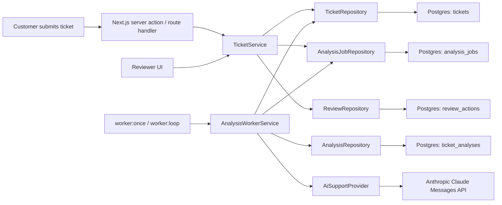
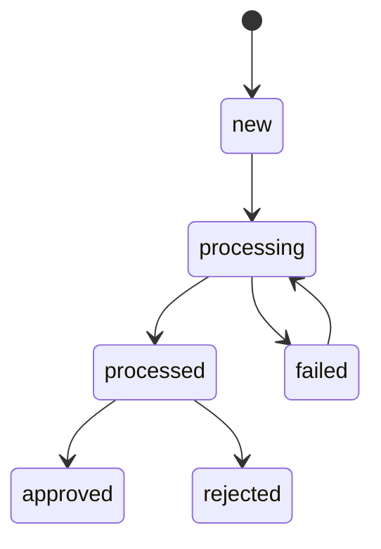
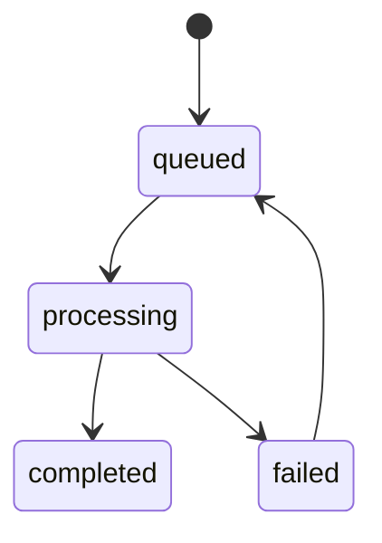
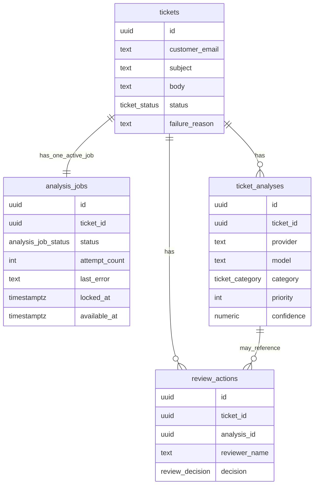

# AI Support Workflow

A beginner-friendly, production-shaped support triage app built with Next.js, TypeScript, Postgres, raw SQL, and Anthropic Claude.

The app accepts a customer ticket, saves it, enqueues background AI analysis work, lets a worker classify the ticket and draft a reply, validates the returned JSON, stores the analysis, and lets a human reviewer approve, edit, reject, or retry the workflow when analysis fails.

## What It Does Now

- Accept customer support tickets from a web form
- Persist tickets in Postgres
- Enqueue AI analysis work in a dedicated `analysis_jobs` table
- Run background processing through a worker loop instead of the submission request path
- Send ticket content to Claude for structured analysis
- Validate AI output with `zod`
- Save analysis and draft reply
- Save short reasons for priority and category confidence
- Let a human reviewer approve, edit, or reject the AI-generated response
- Retry failed analysis jobs by requeuing the same job row
- Keep internal traceability fields like `provider` and `model` in the backend for future provider switching

## Tech Stack

- Next.js App Router
- TypeScript
- Postgres
- Raw SQL with `pg`
- `zod` for runtime validation
- Anthropic Claude via the Messages API
- Vitest for focused workflow tests

## Workflow

```text
submit ticket
-> save ticket
-> enqueue analysis job
-> worker claims job
-> move ticket to processing
-> analyze with Claude
-> validate structured output
-> save analysis
-> mark job completed
-> move ticket to processed
-> human approves / edits / rejects

failure path:
processing -> job failed + ticket failed
failed job -> retry -> queued -> worker claims again
```

## Architecture



## System Design

### 1. UI Layer

The UI is built with Next.js App Router and uses server actions plus route handlers for mutations and data access.

- Home page:
  ticket submission form + review queue
- Ticket detail page:
  original customer ticket, AI analysis, job status, retry controls, draft reply, and human review actions

The ticket detail page also auto-refreshes while a ticket is queued or processing so the reviewer can see background worker progress without manually reloading.

### 2. Service Layer

The app now has two primary service responsibilities:

- `TicketService`
  - validates submission/review input
  - creates tickets
  - enqueues analysis jobs
  - saves human review decisions
  - requeues failed jobs for retry

- `AnalysisWorkerService`
  - polls for queued analysis jobs
  - claims the next available job
  - moves tickets into `processing`
  - calls the AI provider
  - validates and stores analysis
  - marks jobs completed or failed

This is a useful separation of responsibilities:
- the web request path produces work
- the worker consumes work

### 3. Repository Layer

Repositories encapsulate raw SQL:

- `TicketRepository`
- `AnalysisJobRepository`
- `AnalysisRepository`
- `ReviewRepository`

This is the repository pattern in practice: the service layer depends on application-level operations, not SQL strings scattered across pages and handlers.

### 4. AI Integration Layer

`AiSupportProvider` is the abstraction boundary around AI analysis.

Today there is one live implementation:
- `AnthropicSupportProvider`

The provider:
- builds the analysis payload
- sends the request to Claude
- parses structured JSON
- handles fenced-JSON fallbacks
- returns normalized analysis output to the worker service

Even though Anthropic is the only supported provider today, the abstraction is intentionally preserved so OpenAI or another provider can be added later without rewriting the workflow services.

## Domain Model

### Ticket

Source-of-truth entity for the customer request and workflow status.

Important fields:
- `id`
- `customerEmail`
- `subject`
- `body`
- `status`
- `failureReason`

### AnalysisJob

Operational queue entity for background AI work.

Important fields:
- `id`
- `ticketId`
- `status`
- `attemptCount`
- `lastError`
- `lockedAt`
- `availableAt`

`AnalysisJob` is intentionally separate from `Ticket`.
`Ticket` models the business record; `AnalysisJob` models the background work needed to analyze that record.

### TicketAnalysis

Derived AI output associated with a ticket.

Important fields:
- `ticketId`
- `provider`
- `model`
- `category`
- `sentiment`
- `priority`
- `priorityReason`
- `confidence`
- `confidenceReason`
- `summary`
- `draftReply`
- `rawOutput`

`provider` and `model` are internal metadata. They are kept in the backend for traceability and future provider switching, but they are not shown in the reviewer-facing UI.

### ReviewAction

Audit/history entity for human review decisions.

Important fields:
- `ticketId`
- `analysisId`
- `reviewerName`
- `decision`
- `finalReply`
- `notes`

## Ticket and Job Lifecycles



Ticket statuses:
- `new`
- `processing`
- `processed`
- `approved`
- `failed`
- `rejected`



Analysis job statuses:
- `queued`
- `processing`
- `completed`
- `failed`

Important retry rule:
- requeueing a failed analysis job does **not** immediately move the ticket out of `failed`
- the ticket moves back to `processing` only when the worker actually claims the requeued job

## AI Output Contract

Claude is asked to return a raw JSON object with:

```ts
{
  category: "damaged_item" | "refund_request" | "shipping_issue" | "account_issue" | "technical_issue" | "other";
  sentiment: string;
  priority: number;   // 1..5
  priorityReason: string;
  confidence: number; // 0..1 confidence in the selected primary category
  confidenceReason: string;
  summary: string;
  draftReply: string;
}
```

The app validates this structure with `zod` before persisting it.

Important current limitations:
- `priority` and `confidence` are model-generated heuristics
- the app validates their format and bounds, but does not compute or calibrate them itself
- `priorityReason` and `confidenceReason` make those heuristics more inspectable, but they are still model-authored explanations

Confidence meaning in the current system:
- `confidence` means confidence in the selected primary category assignment
- it does not mean confidence in the entire analysis or confidence that the drafted reply is perfect
- `confidenceReason` should explain why the chosen category is clear or ambiguous relative to the other categories

## Database Schema

The app uses four main tables:

- `tickets`
- `analysis_jobs`
- `ticket_analyses`
- `review_actions`

High-level relationships:



## Local Development

### 1. Install dependencies

```bash
npm install
```

### 2. Configure environment

Create `.env` with at least:

```bash
DATABASE_URL=postgres://...
ANTHROPIC_API_KEY=...
ANTHROPIC_MODEL=claude-opus-4-6
```

### 3. Run migrations

```bash
npm run db:migrate
```

### 4. Start the app

Run the web app only:

```bash
npm run dev
```

Run the web app and background worker together:

```bash
npm run dev:full
```

Run one worker cycle manually:

```bash
npm run worker:once
```

Run the background worker loop directly:

```bash
npm run worker:loop
```

## Testing and Verification

Run the focused workflow tests:

```bash
npm test
```

Run type checking:

```bash
npm run typecheck
```

Run a production build check:

```bash
npm run build
```

Current automated coverage includes:
- ticket state transitions
- Claude JSON parsing and fenced-JSON fallback
- `TicketService` submit/review/retry behavior
- `AnalysisWorkerService` idle, success, and failure paths

## Observability and Debugging

The app logs workflow events to the terminal, including:

- ticket validation and persistence
- job enqueueing
- worker polling and claim events
- ticket status transitions
- Claude request/response timing
- raw analysis text from Claude
- JSON parsing path
- validated analysis fields
- worker completion and failure
- retry requested / accepted / committed
- human review decisions

This makes the async queue handoff and AI step much easier to inspect during development.

## OOP Concepts Used

- Entity:
  `Ticket`, `AnalysisJob`, `TicketAnalysis`, and `ReviewAction` model real business and operational objects
- Encapsulation:
  repositories hide SQL details and services hide workflow orchestration details
- Abstraction:
  `AiSupportProvider` isolates AI integration details from workflow code
- Composition:
  services coordinate repositories and provider instances
- Coupling:
  UI depends on services, not directly on SQL or Anthropic APIs
- Invariants:
  ticket and job state transitions are guarded by workflow rules
- Repository pattern:
  persistence logic is centralized behind repository classes
- Object lifecycle:
  tickets and analysis jobs move through explicit workflow states

## Current Boundaries

This version is intentionally still a learner project:

- customer intake and reviewer workspace are still compressed into one app surface
- reviewer routes are not yet protected by auth
- only Anthropic is active today
- provider switching is prepared for internally, but not exposed as a config choice in product UX
- retry uses immediate requeue with no backoff or max-attempt policy yet
- stale lock recovery is not implemented yet

That said, the app is no longer an inline-only toy. It now has:
- real persistence
- real background processing
- real retry behavior
- real workflow tests
- a clear seam for future security, role separation, and provider expansion
