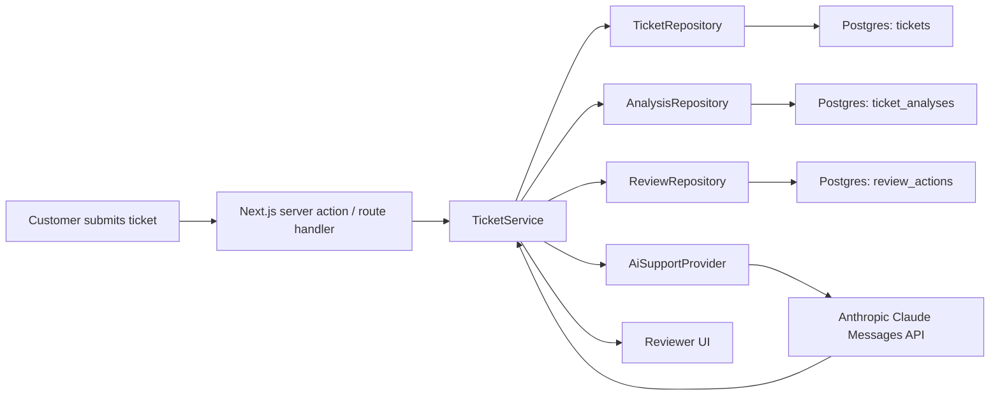
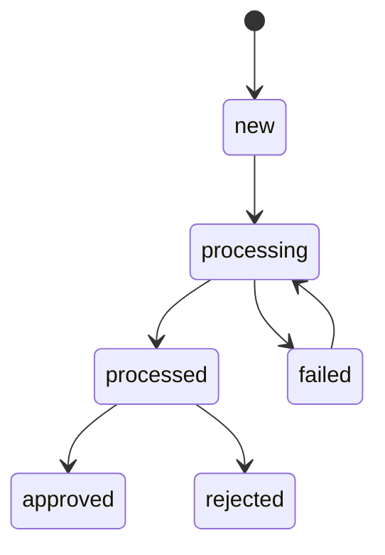
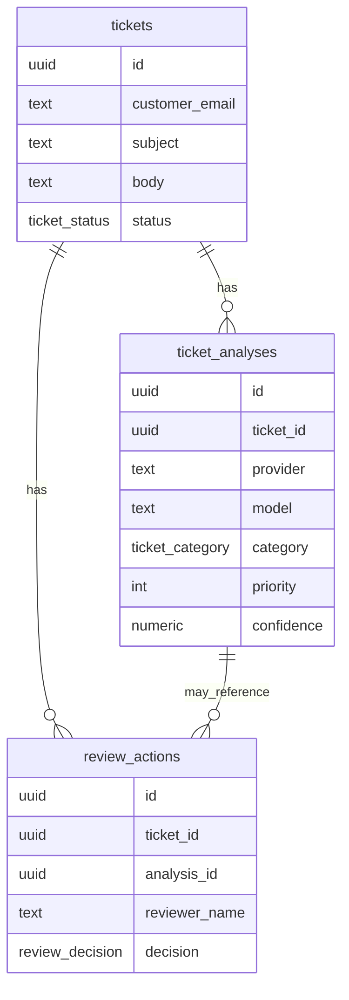

# AI Support Workflow

A beginner-friendly, production-shaped support triage app built with Next.js, TypeScript, Postgres, raw SQL, and Anthropic Claude.

The app takes a customer ticket, saves it, asks Claude to classify it and draft a reply, validates the returned JSON, stores the analysis, and lets a human reviewer approve, edit, or reject the result.

## What This V1 Does

- Accept customer support tickets from a web form
- Persist tickets in Postgres
- Send ticket content to Claude for structured analysis
- Validate AI output with `zod`
- Save analysis and draft reply
- Let a human reviewer approve, edit, or reject the AI-generated response
- Keep internal traceability fields like `provider` and `model` in the backend for future provider switching

## Tech Stack

- Next.js App Router
- TypeScript
- Postgres
- Raw SQL with `pg`
- `zod` for runtime validation
- Anthropic Claude via the Messages API

## Workflow

```text
submit ticket
-> save ticket
-> move ticket to processing
-> analyze with Claude
-> validate structured output
-> save analysis
-> move ticket to processed
-> human approves / edits / rejects
```

## Architecture



## System Design

### 1. UI Layer

The UI is built with Next.js App Router and uses server actions plus route handlers for mutations and data access.

- Home page:
  ticket submission form + review queue
- Ticket detail page:
  original customer ticket, AI analysis, draft reply, and human review actions

### 2. Service Layer

`TicketService` is the workflow orchestrator.

It is responsible for:
- validating input
- creating tickets
- transitioning ticket status
- calling the AI provider
- validating AI output
- saving the analysis
- saving human review decisions

This keeps the UI thin and centralizes workflow behavior in one place.

### 3. Repository Layer

Repositories encapsulate raw SQL:

- `TicketRepository`
- `AnalysisRepository`
- `ReviewRepository`

This is the repository pattern in practice: the service layer depends on application-level operations, not SQL strings scattered across pages and handlers.

### 4. AI Integration Layer

`AiSupportProvider` is the abstraction boundary around AI analysis.

Today there is one live implementation:
- `AnthropicSupportProvider`

The provider:
- builds the analysis payload
- sends the request to Claude
- parses structured JSON
- handles fenced-JSON fallbacks
- returns normalized analysis output to the service layer

Even though Anthropic is the only supported provider in this v1, the abstraction is intentionally preserved so OpenAI or another provider can be added later without rewriting the workflow service.

## Domain Model

### Ticket

Source-of-truth entity for the customer request and workflow status.

Important fields:
- `id`
- `customerEmail`
- `subject`
- `body`
- `status`
- `failureReason`

### TicketAnalysis

Derived AI output associated with a ticket.

Important fields:
- `ticketId`
- `provider`
- `model`
- `category`
- `sentiment`
- `priority`
- `confidence`
- `summary`
- `draftReply`
- `rawOutput`

`provider` and `model` are internal metadata. They are kept in the backend for traceability and future provider switching, but they are not shown in the reviewer-facing UI.

### ReviewAction

Audit/history entity for human review decisions.

Important fields:
- `ticketId`
- `analysisId`
- `reviewerName`
- `decision`
- `finalReply`
- `notes`

## Ticket Lifecycle



Statuses:
- `new`
- `processing`
- `processed`
- `approved`
- `failed`
- `rejected`

## AI Output Contract

Claude is asked to return a raw JSON object with:

```ts
{
  category: "damaged_item" | "refund_request" | "shipping_issue" | "account_issue" | "technical_issue" | "other";
  sentiment: string;
  priority: number;   // 1..5
  confidence: number; // 0..1
  summary: string;
  draftReply: string;
}
```

The app validates this structure with `zod` before persisting it.

Important current limitation:
- `priority` and `confidence` are model-generated heuristics in this v1
- the app validates their format and bounds, but does not compute or calibrate them itself

## Database Schema

The app uses three main tables:

- `tickets`
- `ticket_analyses`
- `review_actions`

High-level relationships:



Initial schema is created by:

- [migrations/001_create_support_workflow.sql]

## Observability and Debugging

The app logs workflow events to the terminal, including:

- ticket validation and persistence
- status transitions
- Claude request/response timing
- raw analysis text from Claude
- JSON parsing path
- validated analysis fields
- human review decisions

This makes the AI step much easier to inspect during development.

## OOP Concepts Used

- Entity:
  `Ticket`, `TicketAnalysis`, and `ReviewAction` model real domain objects
- Encapsulation:
  repositories hide SQL details
- Abstraction:
  `AiSupportProvider` isolates AI integration details from workflow code
- Composition:
  `TicketService` coordinates repositories and provider instances
- Coupling:
  UI depends on the service layer, not directly on SQL or Anthropic APIs
- Invariants:
  ticket state transitions are guarded
- Repository pattern:
  persistence logic is centralized behind repository classes
- Object lifecycle:
  tickets move through explicit workflow states

## Current V1 Boundaries

This version is intentionally simple:

- analysis runs inline during submission, so users wait on model latency
- priority/confidence are not rubric-based yet
- only Anthropic is active today
- provider switching is prepared for internally, but not exposed as a config choice in product UX
- no full automated unit/integration/e2e test suite yet

That makes this a solid v1 foundation: real workflow, real persistence, real AI integration, and a clean seam for future improvements.
